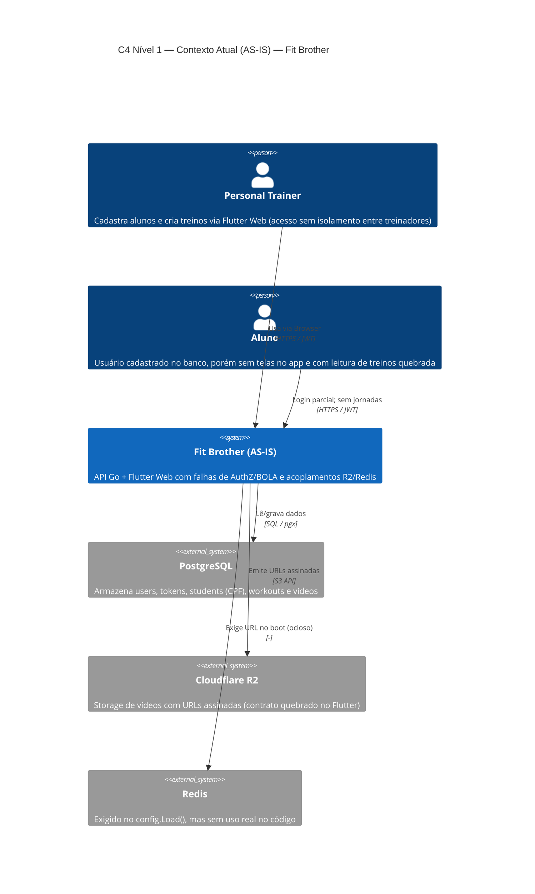
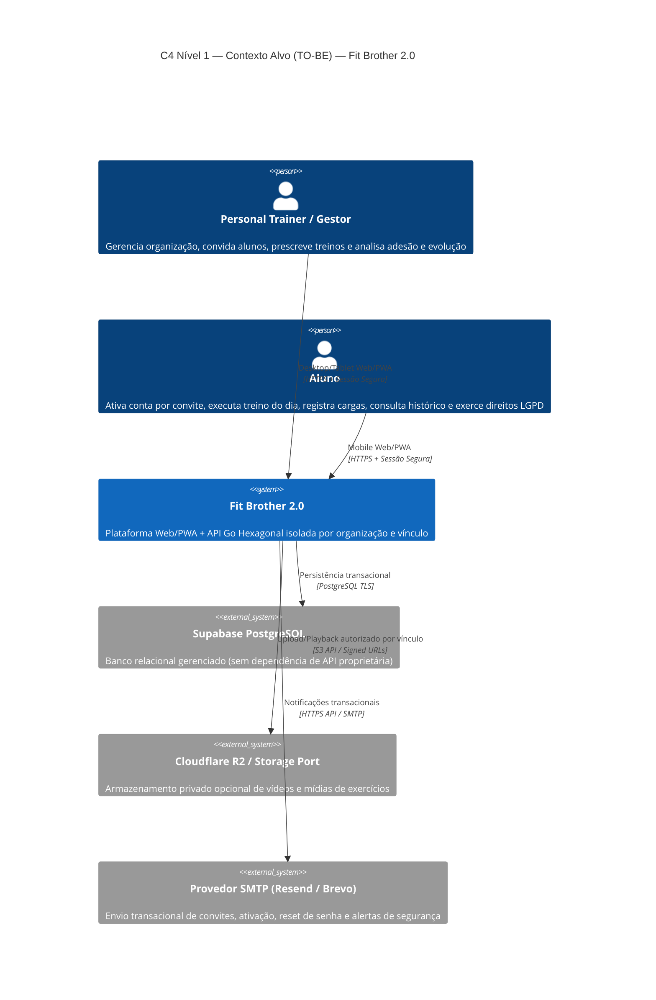

# Diagramas de Contexto do Sistema (C4 Nível 1 — AS-IS vs TO-BE)

## 1. Contexto Atual (AS-IS)

```mermaid
C4Context
    title C4 Nível 1 — Contexto Atual (AS-IS) — Fit Brother
    Person(trainer, "Personal Trainer", "Cadastra alunos e cria treinos via Flutter Web (acesso sem isolamento entre treinadores)")
    Person(student, "Aluno", "Usuário cadastrado no banco, porém sem telas no app e com leitura de treinos quebrada")
    System(fitbrother, "Fit Brother (AS-IS)", "API Go + Flutter Web com falhas de AuthZ/BOLA e acoplamentos R2/Redis")
    System_Ext(pg, "PostgreSQL", "Armazena users, tokens, students (CPF), workouts e videos")
    System_Ext(r2, "Cloudflare R2", "Storage de vídeos com URLs assinadas (contrato quebrado no Flutter)")
    System_Ext(redis, "Redis", "Exigido no config.Load(), mas sem uso real no código")

    Rel(trainer, fitbrother, "Usa via Browser", "HTTPS / JWT")
    Rel(student, fitbrother, "Login parcial; sem jornadas", "HTTPS / JWT")
    Rel(fitbrother, pg, "Lê/grava dados", "SQL / pgx")
    Rel(fitbrother, r2, "Emite URLs assinadas", "S3 API")
    Rel(fitbrother, redis, "Exige URL no boot (ocioso)", "-")
```

---

## 2. Contexto Proposto (TO-BE)

```mermaid
C4Context
    title C4 Nível 1 — Contexto Alvo (TO-BE) — Fit Brother 2.0
    Person(trainer, "Personal Trainer / Gestor", "Gerencia organização, convida alunos, prescreve treinos e analisa adesão e evolução")
    Person(student, "Aluno", "Ativa conta por convite, executa treino do dia, registra cargas, consulta histórico e exerce direitos LGPD")
    System(fitbrother, "Fit Brother 2.0", "Plataforma Web/PWA + API Go Hexagonal isolada por organização e vínculo")
    System_Ext(supabase_pg, "Supabase PostgreSQL", "Banco relacional gerenciado (sem dependência de API proprietária)")
    System_Ext(r2, "Cloudflare R2 / Storage Port", "Armazenamento privado opcional de vídeos e mídias de exercícios")
    System_Ext(smtp, "Provedor SMTP (Resend / Brevo)", "Envio transacional de convites, ativação, reset de senha e alertas de segurança")

    Rel(trainer, fitbrother, "Desktop/Tablet Web/PWA", "HTTPS + Sessão Segura")
    Rel(student, fitbrother, "Mobile Web/PWA", "HTTPS + Sessão Segura")
    Rel(fitbrother, supabase_pg, "Persistência transacional", "PostgreSQL TLS")
    Rel(fitbrother, r2, "Upload/Playback autorizado por vínculo", "S3 API / Signed URLs")
    Rel(fitbrother, smtp, "Notificações transacionais", "HTTPS API / SMTP")
```
